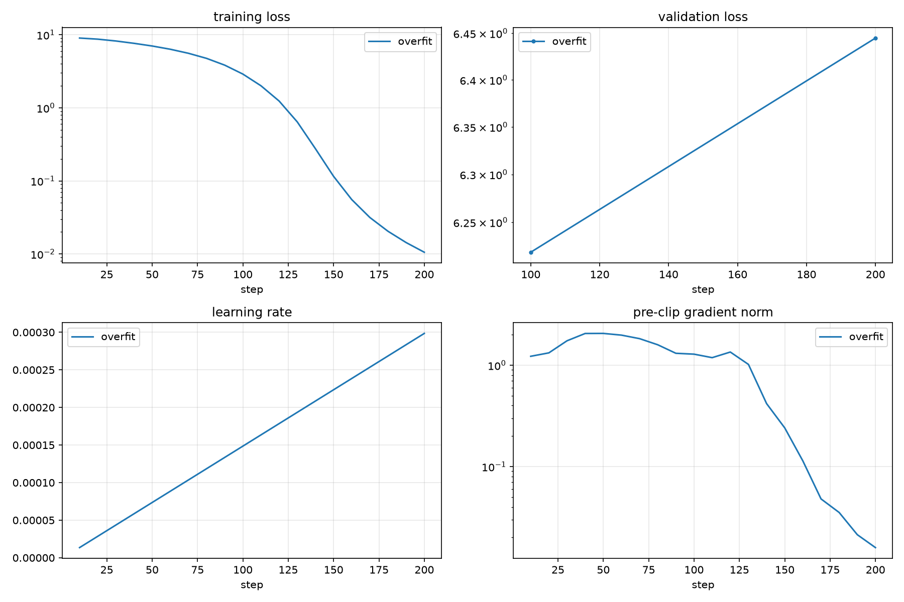
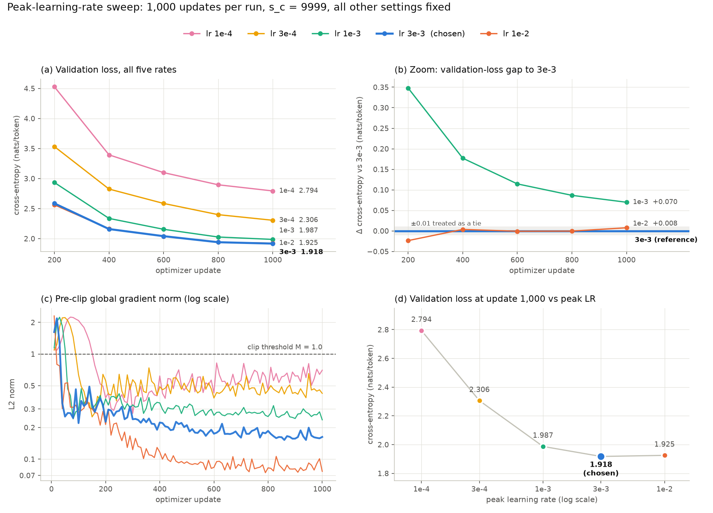
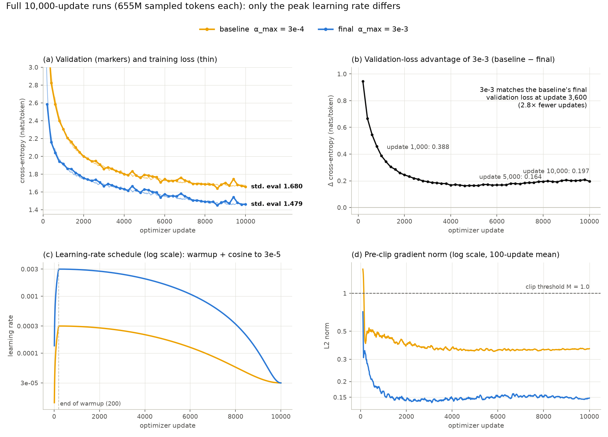
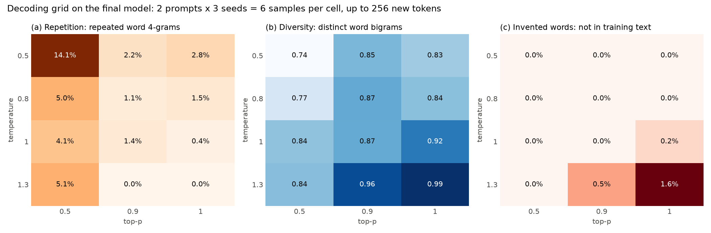

# Training and Inference Report

This report should document and analyze the decisions you made while training and
evaluating your Transformer language model.

The goal is not to follow a prescribed sequence of experiments. Instead, use the
report to explain your experimental process, the evidence that informed your
decisions, and what you learned about the behavior of your model.

You may use tables, plots, generated samples, or other quantitative evidence
wherever they help support your discussion. Figures should be placed under
`report_assets/`.

The final model, training results, and generated samples discussed in this report
must all correspond to the same final trained model.

## 1. Training Hyperparameter Exploration

Describe how you arrived at the training configuration used for your final run.

Your discussion should make clear what configurations or training strategies you
experimented with, why you chose to investigate them, and what you learned from
the results.

Include enough quantitative evidence to support your conclusions. For example,
you may compare validation-loss curves, training-loss curves, gradient norms,
learning-rate schedules, or other quantities that were useful during your
experiments.

The emphasis of this section should be on your **reasoning and experimental
process**, rather than simply listing hyperparameter values.

<b>Your response here:</b>

### Short version

I tuned one thing: the peak learning rate $\alpha_{\max}$. I ran five values from
$10^{-4}$ to $10^{-2}$ for 1,000 updates each, keeping everything else fixed.
The loss kept improving up to $3\times10^{-3}$ and then flattened, so the final
run uses $\alpha_{\max} = 3\times10^{-3}$. That is ten times the recommended
starting point. Nothing else in the configuration changed.

| | Recommended start ($3\times10^{-4}$) | My final choice ($3\times10^{-3}$) |
|---|---:|---:|
| Validation loss after 1,000 updates | 2.306 | **1.918** |
| Standardized validation loss after 10,000 updates | 1.680 | **1.479** |
| Standardized perplexity after 10,000 updates | 5.37 | **4.39** |

### Checking the pipeline first

Before comparing anything, I wanted to know the training loop itself was
correct. A comparison between two learning rates means nothing if the loss or
the optimizer is quietly broken.

The first check was the fixed-batch overfit test from §5.3. I sampled a single
batch of 16 sequences of 256 tokens and optimized the full 19.27M parameter
model on it for 200 updates. The training loss went from about 9.0 to 0.011. On
the same updates, the validation loss rose from 6.22 to 6.45, which is what
memorizing one batch should look like. I took this as good evidence that the
forward pass, loss, backward pass, clipping and AdamW update were all wired up
correctly.

*Figure 1. Overfitting one fixed batch. Training loss (log scale) collapses while
validation loss goes up.*

The second check was a full 10,000-update run with the recommended settings
($\alpha_{\max} = 3\times10^{-4}$). I mainly wanted to confirm that the
long-running parts held up over a whole Kaggle session: checkpointing, resuming,
fp16 on the T4, the cosine schedule and the model export. It finished with a
standardized validation loss of 1.680 (perplexity 5.37) and no non-finite
losses. This run became my baseline. Its first 1,000 updates also double as the
$3\times10^{-4}$ point in the sweep below, because the settings are identical.

### Why the learning rate

Looking at the baseline's logs, two things suggested it was taking steps that
were too small. At update 1,000 the validation loss was still falling by about
0.09 nats every 200 updates. The gradient norm stayed between 0.4 and 0.65 and
never showed a spike, so there was room to push harder.

The budget in this assignment is a fixed number of optimizer updates, not a
fixed amount of time or data. So what matters is how much each update achieves.
With AdamW the size of an update is set mostly by the learning rate and hardly
at all by the scale of the gradient, which made $\alpha_{\max}$ the obvious
first thing to tune.

### How the sweep was controlled

I only changed $\alpha_{\max}$. Everything below was identical across runs:

| Held fixed | Value |
|---|---|
| Architecture | $d_{\text{model}}=512$, 4 layers, 16 query and 4 KV heads, $d_{ff}=1344$, RoPE $\Theta=10^4$ (19,272,192 parameters) |
| Batch | $B=16$, $n_{\text{acc}}=16$, $n=256$, so 65,536 tokens per update and 65.5M tokens per 1,000-update run |
| Schedule | 200 warmup updates, then cosine decay towards $\alpha_{\min}=3\times10^{-5}$ at $s_c=9999$ |
| Optimizer | AdamW with $\beta=(0.9, 0.95)$, $\varepsilon=10^{-8}$, $\lambda=0.1$, gradient clipping at $M=1.0$ |
| Seeds | model initialization 0, training generator 1, validation generator 2 |
| Validation | every 200 updates on 20 batches of 16 × 256 tokens |
| Hardware | Kaggle Tesla T4 in fp16, about 35k tokens/s, roughly 33 minutes per run |

Two of these choices shape how the results should be read.

I kept $s_c = 9999$ instead of shrinking the cosine to 1,000 steps, as §7.2
suggests. Each short run is then exactly the first 1,000 updates of the
matching full run. The catch is that the learning rate has barely started to
decay by update 1,000 (the $3\times10^{-3}$ run is still at
$2.95\times10^{-3}$). So these runs tell me how fast each rate learns at its
peak. They say nothing about what annealing adds later. I come back to this in
Section 2.

Because the validation generator uses the same seed, every run is scored on
exactly the same validation batches at the same update. That makes the
comparison paired: when one batch is unusually hard, it is hard for every run.
Even so, each rate was only trained with one seed, so I treat any difference
under about 0.01 nats as a tie.

### Running the sweep

I started with $\{10^{-4}, 3\times10^{-4}, 10^{-3}\}$, spaced by factors of about
3 around the recommended value. All three improved in order, and the best one,
$10^{-3}$, was at the top edge of the grid. When the winner sits on the boundary
you can't tell where the optimum is, so I added $3\times10^{-3}$ and $10^{-2}$
and kept going until the curve stopped improving.

*Figure 2. (a) Validation loss for all five rates. (b) Zoom on the top three:
each run's validation loss minus the $3\times10^{-3}$ run's, with the ±0.01 tie
band shaded. (c) Pre-clip gradient norm, with the clip threshold dashed.
(d) Validation loss at update 1,000 against the peak learning rate.*

Validation cross-entropy in nats/token (20 batches, the same batches for every
run):

| Update | 1e-4 | 3e-4 (baseline) | 1e-3 | 3e-3 | 1e-2 |
|---:|---:|---:|---:|---:|---:|
| 200 | 4.527 | 3.532 | 2.934 | 2.586 | **2.563** |
| 400 | 3.394 | 2.826 | 2.337 | **2.160** | 2.163 |
| 600 | 3.099 | 2.586 | 2.156 | 2.041 | **2.040** |
| 800 | 2.896 | 2.399 | 2.027 | **1.940** | **1.940** |
| **1,000** | 2.794 | 2.306 | 1.987 | **1.918** | 1.925 |
| Perplexity at 1,000 | 16.34 | 10.03 | 7.30 | **6.80** | 6.86 |
| Change from the previous rate | | −0.488 | −0.319 | −0.070 | +0.008 |
| Improvement from update 800 to 1,000 | 0.102 | 0.094 | 0.040 | 0.023 | 0.015 |

### What the sweep showed

The gains shrank with every step up and then stopped. Going from
$10^{-4}$ to $3\times10^{-4}$ saved 0.49 nats, the next step saved 0.32, the
one after that only 0.07, and the jump to $10^{-2}$ saved nothing (it was 0.008
worse, which is inside my tie band). Panel (d) of Figure 2 makes the shape easy
to see: steep on the left, flat between $3\times10^{-3}$ and $10^{-2}$. The good
range turned out to be about ten times higher than the recommended value.

The fastest start did not last. At update 200, $10^{-2}$ was ahead of
everything. By update 400 the $3\times10^{-3}$ run had caught it, and by
update 1,000 it was slightly behind. It also improved the least over the last
200 updates (0.015, against 0.023 for $3\times10^{-3}$). My reading is that a
very large step gets the easy structure quickly and then has a harder time
settling into the finer details.

None of the runs were unstable, which surprised me a little for $10^{-2}$. No
run produced a non-finite loss, and after the early warmup phase no gradient
norm came anywhere near the clip threshold.

The gradient norm plot had one pattern I didn't expect. Every run has the same
early spike to a norm of about 2.1 to 2.3, around the point where the loss falls
from roughly 8.5 to 7. That is the model moving from uniform guesses to basic
word frequencies. The height of the spike is the same at every learning rate.
Only the timing moves: around update 10 for $10^{-2}$, 20 for $3\times10^{-3}$,
30 for $10^{-3}$, 50 for $3\times10^{-4}$ and 70 for $10^{-4}$. So the spike
belongs to a stage of learning, not to the step size, and clipping only kicks
in during that stage.

After warmup, bigger learning rates settle at smaller gradient norms: about 0.5
to 0.8 at $10^{-4}$, 0.4 to 0.65 at $3\times10^{-4}$, around 0.25 to 0.3 at
$10^{-3}$, about 0.16 at $3\times10^{-3}$ and about 0.08 at $10^{-2}$. Part of
this is that the faster runs reach flatter, lower-loss regions sooner. Part of it
is weight decay. AdamW shrinks the weights by $\alpha\lambda$ every update, and at
$10^{-2}$ that is $10^{-3}$ per update, 33 times more than in the baseline.

Training and validation loss stayed close throughout (1.867 against 1.918 at
update 1,000 for $3\times10^{-3}$). A 1,000-update run only sees 65.5M tokens,
about 14% of the 467M-token training stream, so none of these runs is anywhere
near overfitting. The only question at this stage is how fast each one learns.

### Picking $3\times10^{-3}$ over $10^{-2}$

The two were tied at 1,000 updates, so I had to decide on other grounds. I went
with $3\times10^{-3}$ for these reasons:

- It had the lower validation loss at update 1,000 and was still improving
  faster at the end of the run.
- The risks are lopsided. A rate slightly too low costs a bit of final loss. A
  rate too high can blow up hours into a 5-hour run, and 1,000 updates is not
  long enough to rule that out, especially in fp16.
- At $10^{-2}$ the per-update weight decay is also 3.3 times stronger than at
  $3\times10^{-3}$. Picking it would change two things at once, not just the
  step size.

Everything else stayed at the recommended values: warmup, $\alpha_{\min}$,
weight decay, the betas and the batch size. One side effect I should point out:
since $\alpha_{\min}$ stayed at $3\times10^{-5}$, the new schedule decays to 1%
of its peak, while the baseline decays to 10%.

### What I did not tune

A short run costs about 33 GPU minutes and a full run about 5.2 GPU hours on my
Kaggle quota, so I spent the budget on the setting I expected to matter most.

I deliberately left the batch size and $n_{\text{acc}}$ alone. With the budget
fixed in updates, a different batch size also changes how many tokens the model
sees (§7.2), so data and optimization would get mixed up in one comparison.
Warmup length, weight decay, $\beta_2$ and $\alpha_{\min}$ would be the next
things I'd try with more compute.

The obvious weakness is that my ranking comes from short runs at a nearly
constant learning rate, with one seed each. The gap between learning rates
could shrink once the schedule anneals. Section 2 tests exactly that by
comparing the two full 10,000-update runs.

## 2. Final Training Run

Describe the final training run using the configuration you selected.

Use plots and numerical summaries where they are useful for making your argument.

<b>Your response here:</b>

### Configuration

The final run uses the configuration chosen in Section 1. The only difference
from the recommended starting point is $\alpha_{\max}$.

| Setting | Value |
|---|---|
| Model | 19,272,192 parameters: $d_{\text{model}}=512$, 4 layers, 16 query and 4 KV heads, $d_{ff}=1344$, context 256 |
| Updates | 10,000 (steps 0 to 9999) |
| Tokens | $16 \times 16 \times 256 = 65{,}536$ per update, 655,360,000 in total (about 1.4 times the 467M-token training stream) |
| Learning rate | linear warmup to $3\times10^{-3}$ at update 200, cosine down to $3\times10^{-5}$ at $s_c = 9999$ |
| Optimizer | AdamW, $\beta=(0.9, 0.95)$, $\varepsilon=10^{-8}$, $\lambda=0.1$, global clip at $M=1.0$ |
| Seeds | model 0, training generator 1, validation generator 2, the same as every other run |
| Monitoring | 20-batch validation every 200 updates, a log line every 10, a checkpoint every 500 |
| Hardware | Kaggle Tesla T4, fp16 autocast with loss scaling, median 34,700 tokens/s, about 5.2 hours of training |

The run completed all 10,000 updates in a single session. The exported
`final_model.pt` holds exactly 19,272,192 fp16 values, all finite. After
downloading it I ran the standardized evaluation again on my own machine and got
the same number Kaggle reported, to four decimal places, so the file I am
submitting is the one I evaluated.

### Comparison with the baseline

The baseline uses the same seeds and settings with $\alpha_{\max} = 3\times10^{-4}$.
Having a full-length run of both learning rates lets me answer the question left
open in Section 1: does the short-run advantage survive once the schedule
anneals?

*Figure 3. (a) 20-batch validation loss (markers) and training loss averaged over
100 updates (thin lines). (b) The validation-loss gap between the two runs.
(c) The two learning-rate schedules. (d) Pre-clip gradient norm, averaged over
100 updates.*

Validation cross-entropy during training (20 batches, nats/token):

| Update | 200 | 1,000 | 2,000 | 4,000 | 6,000 | 8,000 | 10,000 | Standardized (100 batches) |
|---|---:|---:|---:|---:|---:|---:|---:|---:|
| Baseline, 3e-4 | 3.532 | 2.306 | 2.001 | 1.801 | 1.744 | 1.685 | 1.658 | 1.680 |
| **Final, 3e-3** | **2.586** | **1.918** | **1.756** | **1.634** | **1.576** | **1.491** | **1.461** | **1.479** |
| Gap | 0.946 | 0.388 | 0.244 | 0.167 | 0.169 | 0.195 | 0.197 | 0.201 |

### What the curves show

The decision from the short runs held up. The $3\times10^{-3}$ run is ahead at
all 50 validation points. It reaches the baseline's final validation loss (1.658)
by update 3,600, which is 2.8 times fewer updates for the same quality. At the
end it is 0.20 nats/token better on the standardized evaluation, and perplexity
drops from 5.37 to 4.39, an 18% reduction.

The gap in Figure 3(b) goes through three phases. Up to about update 4,000 it
closes fast, from 0.95 to about 0.17, as the slower run catches up on the easy
structure both runs eventually learn. Between 4,000 and 6,000 it stays flat at
about 0.165 (the smallest value is 0.163 at update 4,600). Then, as the cosine
schedule comes down, the gap grows again, to 0.197 at the end.

So the higher learning rate got more out of annealing, which is the opposite of
what I was worried about in Section 1. My explanation is that the fast run spent
most of training at a step size where update noise limited how low it could go.
Dropping the step 100-fold, from $3\times10^{-3}$ to $3\times10^{-5}$, removes
that noise. The baseline only drops its step 10-fold because I didn't rescale
$\alpha_{\min}$, and that is probably part of the effect. I can't separate the
two with the runs I have, so I wouldn't credit the late widening to the peak
learning rate alone.

Training was stable from start to finish. There were no non-finite losses. After
warmup the pre-clip gradient norm never reached the clip threshold; its maximum
over the last 9,800 updates was 0.32 (the baseline's was 0.74). The norm
settles between 0.14 and 0.17 by about update 1,500 and stays there. After
update 300 the logged training loss never jumps by more than 0.15 between log
points.

At first the bumps in the validation curve worried me: +0.07 at update 9,400
and +0.05 at 4,400, for example. Then I noticed they happen at the same updates
in both runs, with almost the same size (baseline +0.073 and +0.046, final run
+0.072 and +0.049). Both runs draw validation batches from the same seeded
generator, so at any given update they are scored on the same 20 batches. A bump
that shows up in both is a hard set of batches, not a problem with either model.
This is also why I only use the 20-batch numbers for trends. The number I report
comes from the separate 100-batch evaluation in Section 3.

Finally, there is no sign of overfitting. The average training loss over the last
200 updates is 1.464, essentially the same as the final validation loss of
1.461. The run samples 655M tokens at random from a 467M-token stream, so most
windows are seen about once. At this size the model is limited by its capacity
and the update budget, not by memorization. More updates or a bigger model would
help more than extra regularization.

## 3. Final validation performance

Evaluate the final model on the validation set and report its validation
cross-entropy and perplexity.

For the standardized evaluation, use a fresh `torch.Generator` seeded with 42
and evaluate over 100 validation batches of 16 sequences of length 256.

Report:

- mean validation cross-entropy in nats/token;
- perplexity computed as

$$
\operatorname{PPL} = \exp(\text{mean validation cross-entropy}).
$$

Do not average separately computed per-batch perplexities.

<b>Your response here:</b>

| Model | Mean validation cross-entropy | Perplexity |
|---|---:|---:|
| **Final model** (`final_model.pt`, $\alpha_{\max}=3\times10^{-3}$) | **1.4794 nats/token** | **4.390** |
| Baseline with the same budget ($\alpha_{\max}=3\times10^{-4}$) | 1.6801 nats/token | 5.366 |
| Uniform guess over 8,192 tokens, for reference | $\ln 8192 = 9.011$ | 8,192 |

The raw output is in `report_assets/final_model_eval.json`, produced by
`src/evaluate.py`. The procedure:

1. Build the fixed architecture and load the fp16 state dictionary from
   `final_model.pt`.
2. Create a fresh `torch.Generator().manual_seed(42)`. It has nothing to do with
   the generators used during training, so the result doesn't depend on how
   often validation ran.
3. Sample 100 batches of 16 sequences × 256 tokens from `validation.bin`, which is
   409,600 predicted tokens in total. Compute each batch's mean cross-entropy
   under `model.eval()` and `torch.inference_mode()`, then average the 100 batch
   means.
4. Report $\text{PPL} = \exp(1.4794) = 4.390$.

The perplexity is one exponential of the mean loss, not an average of per-batch
perplexities. Because $\exp$ is convex, averaging per-batch perplexities would
give a higher number than the true value.

I ran this evaluation twice: once on Kaggle straight after training, and once
locally on the downloaded `final_model.pt`. Both gave 1.4794 and 4.390.

A perplexity of 4.39 means that on an average token the model is about as
uncertain as if it were choosing uniformly among 4.4 options, out of a vocabulary
of 8,192. The standardized number is 0.018 higher than the last 20-batch reading
during training (1.461). That is about what I'd expect from scoring a different
and larger set of batches, and it's in line with the batch-to-batch variation
discussed in Section 2.

## 4. Inference and Decoding Analysis

Investigate how the behavior of your trained model changes under different
decoding strategies.

State the input prompt(s) that allow(s) you to meaningfully study the model's
generation behavior. Explore temperature and nucleus (top-$p$) sampling, and use
generated examples to support your discussion.

Include representative generated examples. Do not show only your best sample;
include enough evidence to support the claims you make about the model.

<b>Your response here:</b>

### Setup

Generation uses `generate()` in `src/generate.py`. At every step it keeps the
last 256 tokens, takes the logits at the final position and divides them by the
temperature $\tau$. It then applies a stable softmax and sorts the probabilities.
It keeps the shortest prefix whose cumulative probability reaches $p$,
renormalizes, and samples with `torch.multinomial` using a seeded generator.
Generation stops after `<|endoftext|>` (token id 0) or after 256 new tokens.

I used two prompts:

- `Once upon a time` is the most common opening in TinyStories and leaves
  everything open. It shows what the model does by default: which names,
  settings and plots it reaches for.
- `Tom and his dog went to the park` fixes two characters and a place. It
  tests whether the model keeps track of what it was given or only produces
  fluent text.

The grid was $\tau \in \{0.5, 0.8, 1.0, 1.3\}$ × $p \in \{0.5, 0.9, 1.0\}$ ×
2 prompts × seeds $\{0, 1, 2\}$, which gives 72 samples, all from the final
model. Every one of them is in `report_assets/final_model_samples.json`. Seed $k$
produces the same random stream in every cell, so at low temperature two cells
with the same seed often share their first sentences and only split where the
settings keep different tokens. That makes the effect of each setting easier to
see.

Reading 72 stories by eye is unreliable, so I also measured three things on the
words in each completion (`scripts/decoding_stats.py`):

- repetition: the share of 4-word sequences that repeat an earlier one in the
  same sample, which picks up loops;
- diversity: distinct word pairs divided by all word pairs;
- invented words: the share of words that never appear in the first 20M
  training tokens (a lexicon of 18,398 words).

*Figure 4. Each cell averages 6 samples (2 prompts × 3 seeds). The samples are
short and few, so the trends matter more than the exact values.*

A rough summary of the grid:

| τ (rows), top-p (columns) | 0.5 | 0.9 | 1.0 |
|---|---|---|---|
| 0.5 | loops (14.1% repeated), 9 of the 18 samples at τ = 0.5 hit the 256-token cap | fluent but formulaic | fluent but formulaic |
| 0.8 | some looping (5.0%) | fluent and varied | fluent and varied |
| 1.0 | some looping (4.1%) | fluent and varied | varied, meaning starts to drift |
| 1.3 | coherent again, but loops (5.1%) | drifting, 0.5% invented words | falls apart, 1.6% invented words, every sample stops early |

### Samples

To avoid cherry-picking, every excerpt below uses seed 1, the middle seed. I
chose cells to cover the grid and did not choose samples. "…" marks cuts I made
for length, and "/" marks a line break in the output.

**τ = 0.5, p = 0.5.** Fluent, but it gets stuck.

> Tom and his dog went to the park. They saw a big slide. Tom wanted to go on the slide. He said, "Let's go on the slide. It looks fun." / Tom said, "No, I want to go on the slide. It looks fun." / Sam said, "Don't be silly. The slide is fun. You can go on the slide. I will go first." / Tom said, "No, I will go first. You go first." / Sam said, "No, I go first. You go first." / Tom said, "No, I go first. You go first." / Sam said, "No, I go first. You go first." *(the same exchange repeats eight more times until the 256-token limit)*

> Once upon a time, there was a little girl named Lily. She loved to play outside in the sunshine. One day, she went to the park with her mommy. They saw a big tree with lots of leaves. Lily wanted to climb the tree, but her mommy said it was too dangerous. … She learned that it's important to help others when they need it.<|endoftext|>

**τ = 0.8, p = 0.9.** The best balance I found.

> Once upon a time, there was a little girl named Lily. She loved to play with her toys and run around outside. One day, she found a shiny rock in her backyard. It was so pretty! / Lily picked up the rock and showed it to her mom. "Look, Mommy! I found a pretty rock!" she said. Her mom smiled and said, "That's a nice rock, Lily. It's a very special rock." … From that day on, Lily kept the rock in a special place in her room where she could see it every day. She knew it was something special and she would always remember it.<|endoftext|>

> Tom and his dog went to the park. They saw many things. They saw birds, squirrels, flowers, and swings. Tom was happy. … One day, Tom saw a big dog. The dog was brown and fluffy. It had a red collar. The dog ran to Tom and wagged its tail. Tom was scared. He did not like dogs. … Tom and the dog played with the ball. They threw the ball and the dog fetches it. …

**τ = 1.0, p = 1.0.** More variety, but the meaning drifts.

> Once upon a time, there was a healthy girl. She was nice, strong and brave. … She smiled and eagerly took out her chop. She chopped and chopped until the dough was ready. … From that day on, the girl wanted everyone to have a bite of her cut. Not only took her friends's sharp strings and flames, they knew she was strong. …<|endoftext|>

**τ = 1.3, p = 1.0.** It falls apart.

> Tom and his dog went to the park. They saw many nuts and flowers. They chose a spot near the tree. The lot people passed the nut and shared it. The more they picked, the slower went quicker. They all laughed and snacksed that day. Everyone was happy.<|endoftext|>

> Once upon a time, there was a healthy grass field. It was a very sunny day, and some boxes of new stuff to explore. / A pony was named Jim. A pig lived in the pretty grass, and<|endoftext|>

**τ = 1.3, p = 0.5.** The same high temperature, rescued by top-p.

> Tom and his dog went to the park. They saw many kids playing and having fun. Tom wanted to join them, but he was shy. He watched them from a distance. / "Can I join them?" Tom asked the boy. / "Sure, you can join us," the boy said. "You are nice and polite. Do you want to play with us?" / Tom nodded. He was happy. He made a new friend. … Tom was glad. He liked the boy. He liked the boy. He liked the boy. He liked his other dog. He liked the dog. He liked the boy. …<|endoftext|>

### What I learned from the grid

**Small top-p causes loops more than low temperature does.** The worst sample is
the first one: with τ = 0.5 and p = 0.5, the most likely next sentence at every
point is a copy of the previous one, and the model picks it every time.
Repetition is highest in that corner (14.1% of 4-word sequences) and diversity
is lowest (0.74). Half of the τ = 0.5 samples ran all the way to the 256-token
limit without ending the story.

What I didn't expect was that the top-p column matters more than the temperature
row. Every cell with p = 0.5 loops (4% to 14% repetition), even at τ = 1.3,
where the last sample above ends up repeating "He liked the boy." Every cell with
p of 0.9 or more stays at 2.8% or below. Keeping only the top half of the
probability mass leaves so few options that nothing breaks the model out of a
repetitive pattern.

**Low temperature also narrows the stories.** For `Once upon a time`, the main
character is "Lily" in 7 of the 9 samples at τ = 0.5. That falls to 4 of 9 at
0.8, 3 at 1.0 and 2 at 1.3. Several of the low-temperature openings are word for
word the same ("…a little girl named Lily. She loved to play outside in the
sunshine…"). TinyStories really does lean heavily on this template, and a low
temperature just hands it back. The text is fluent, but it's always the same
story.

**High temperature without truncation breaks the text.** At τ = 1.3 with
p = 1.0, the distribution is flattened, and with nothing cut off, thousands of
individually unlikely tokens add up to real probability. The model starts
picking them. It invents words ("snacksed" above, and "quickAreoutake",
"giantocular" and "terribiddenment" in other seeds), 1.6% of all words, against
0% at τ = 0.8 and below. It writes sentences that are grammatical but make no
sense, like "the slower went quicker". Every sample in that cell ended early,
averaging 119 new tokens against about 218 at τ = 0.5. Once the text drifts off
the training distribution, an end-of-text token becomes a likely pick too, which
is how the "healthy grass field" sample stops after 42 tokens mid-sentence.

**Top-p undoes most of what a high temperature breaks.** The last sample uses the
same τ = 1.3 as the broken ones but keeps only the top 50% of the probability.
It reads fine. Invented words go from 1.6% to 0% and diversity drops from 0.99
to 0.84. So the problem at τ = 1.3 was never that the plausible tokens were too
evenly weighted. It was the long tail of implausible ones, and that tail is
exactly what nucleus sampling removes. The two settings interact: temperature
changes the shape of the distribution, and top-p decides how much of its tail
survives.

**Even the good samples show the model's limits.** At τ = 0.8 and p = 0.9 the
stories are grammatical, stay on topic and usually end with a TinyStories-style
moral. There are still slips. At τ = 1.0 the girl "took out her chop" and wanted
everyone "to have a bite of her cut", which works word by word but not as a
whole. In the τ = 0.8 dog story, "the dog fetches it" breaks the past tense. The
bigger weakness is keeping track of characters. In the `Tom and his dog`
stories the dog often disappears or merges with someone else. In the first
sample a new character called Sam appears and the dog is never mentioned again.
In the τ = 0.8 one, a second dog shows up and Tom "did not like dogs", even
though he came with one. That seems about right for a 4-layer, 19M-parameter
model with a 256-token window: it has local grammar and story conventions down,
but not who is who across a paragraph.

**One oddity comes straight from the data.** Some samples contain `“` and
`â€`, which are curly quotes decoded with the wrong character encoding. I first
suspected my decoding code, but the same characters appear 7,412 times in the
first 5M training tokens. The model learned them as part of the data.

### Recommended setting

For this model I'd use τ around 0.8 to 1.0 with p = 0.9. In that range repetition
stays low (1.1% to 1.4%), diversity is high (0.87), there are no invented words,
and most stories end on their own (4 or 5 of 6). Lowering p or τ buys safety at
the cost of loops and the same Lily story over and over. Raising τ without
truncation gives novelty at the cost of coherence.

## Submitted Artifacts

Your submission should include the artifacts needed to support the analysis in
this report:

- `final_model.pt`
- figures/visualizations used in this report under `report_assets/`

`final_model.pt` should contain the FP16 CPU state dictionary corresponding to
the final model analyzed in this report.

What I included:

| File | Contents |
|---|---|
| `final_model.pt` | FP16 CPU state dictionary of the $\alpha_{\max}=3\times10^{-3}$ model (19,272,192 values), the model evaluated in Section 3 and sampled in Section 4 |
| `report_assets/fig1_overfit_sanity_check.png` | Figure 1, the fixed-batch overfit check |
| `report_assets/fig2_lr_sweep.png` | Figure 2, the learning-rate sweep |
| `report_assets/fig3_final_run_vs_baseline.png` | Figure 3, the final run against the baseline |
| `report_assets/fig4_decoding_grid.png` | Figure 4, the temperature and top-p statistics |
| `report_assets/final_model_eval.json` | Output of the standardized evaluation |
| `report_assets/final_model_samples.json` | All 72 samples used in Section 4 |
